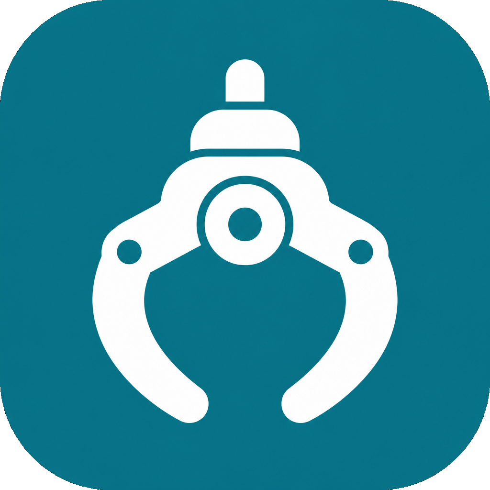

# ShiftGrab

  

  <strong>Free Windows setup</strong> · On-device YouTube &amp; social downloader by ShiftZero 
  No shady converters · Files stay on your PC · Free forever

  
  &nbsp;
  

---

## What is this?

**ShiftGrab** is the official Windows installer for ShiftZero’s on-device media downloader (admin product name: **OmniGrab**).

- Download from **YouTube** and major social platforms
- Pick quality or audio (MP3) where available
- Runs **on your computer** (downloads stay local)
- **Free forever** — no subscription

This repository is a **download hub** for installer releases (same style as [Omni Removal](https://github.com/omniai01/omni-removal)).

---

## How to download & install

1. Click **Download for Windows** above (or open [Latest Release](https://github.com/omniai01/shiftgrab/releases/latest)).
2. Save `ShiftGrab-Final.exe`.
3. Run the setup and follow the on-screen steps.
4. Paste a link and download.

### Tips
- Windows may show a SmartScreen prompt — choose **More info → Run anyway** if you trust this official ShiftZero build.
- Internet is required to fetch media (offline browsing of local jobs/history still works).

---

## Latest version

| Item | Detail |
|------|--------|
| Product | ShiftGrab |
| Version | v1.1.4 |
| Platform | Windows x64 |
| File | `ShiftGrab-Final.exe` |
| Price | Free |

Direct link (always latest):  
https://github.com/omniai01/shiftgrab/releases/latest/download/ShiftGrab-Final.exe

---

## What's included

- Clean Windows desktop app
- Video / channel / playlist / all-in-one social tools
- Jobs queue, library, and local reports
- Bundled media tools for merge & audio extract
- OmniGrab admin: devices, downloads, platforms, notifications, maintenance & updates

---

## Support

Website: [shiftzero.netlify.app](https://shiftzero.netlify.app)

© ShiftZero · ShiftGrab
